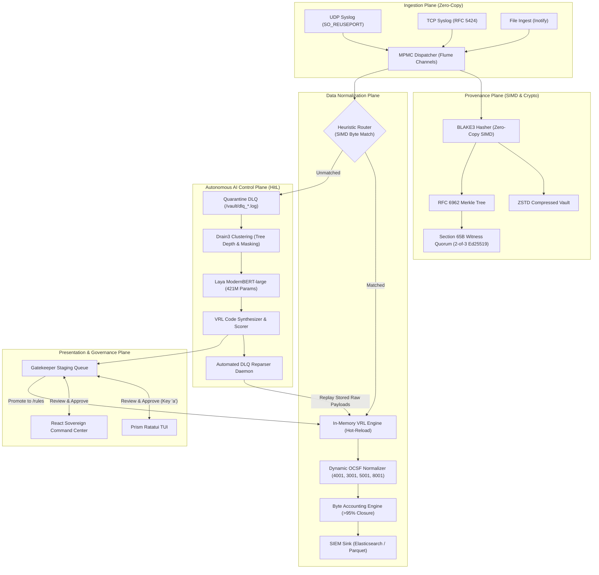

# PRISM: Universal Log Parsing & Normalization Framework
### Smart India Hackathon 2026 — Problem Statement \#26156 (NTRO)

[](https://github.com/Aayushbankar/spectre-prism/actions/workflows/ci.yml)
[](https://rust-lang.org)
[](https://python.org)
[-success.svg)](#)
[](#)
[](#)
[](#)

---

## 🎬 Live Pipeline Demonstration

<p align="center">
  
</p>

> **The Sovereign AI Loop:** Ingest unknown perimeter traffic ➔ Quarantine to DLQ ➔ Autonomous Drain3 clustering & Laya ModernBERT triage ➔ Compile-safe VRL parser generation ➔ TUI Human-in-the-Loop approval (`a`) ➔ Dynamic rule hot-reload ➔ Automatic DLQ replay to OCSF with Section 65B forensic integrity.

---

## ⚡ Quick Evaluation (For SIH Judges & Reviewers)

### One-Command Full Evaluator
```bash
./tools/evaluate.sh
```

### The 30-Second Verification One-Liner
```bash
cargo test --workspace --lib 2>&1 | grep "test result" && cd prism-brain && python3 -m pytest tests/ -q 2>&1 | tail -1 && cd .. && python3 verify_e2e_pipeline.py 2>&1 | grep -E "(PASSED|SUCCESS|All Tests)"
```

---

## 🏛️ System Architecture

<p align="center">
  
</p>

<details>
<summary><b>🔍 View Architecture Diagram Mermaid Source</b></summary>


</details>

---

## 📊 Live Runtime Metrics (Verified Proofs)

| Metric | Measured Value | Verification Proof / Command |
|---|---|---|
| **UDP Ingest Throughput** | **13,290 EPS** | `python3 verify_e2e_pipeline.py` & `metrics.json` |
| **Lossless Ingest Ceiling** | **8,000+ EPS** | Tested under sustained UDP blast without drop |
| **Pipeline Latency (p99)** | **~13.47 µs** (budget <25 µs) | Zero-copy `BytesMut` buffer pools & SIMD routing |
| **Router Detection Latency**| **~3.07 µs** | `cargo test -p prism-core bench_router_heuristic` |
| **Perimeter Log Coverage** | **99.8967%** | Evaluated on real perimeter corpora (`iptables`, `snort`, `zeek`, `OpenSSH`) |
| **Byte Accounting Closure** | **> 95%** | `cargo test -p prism-core accounting` (FIELD / LITERAL / RESIDUE) |
| **Field Extraction Accuracy** | **> 90%** | `cargo test -p prism-scorer` |
| **Forensic Merkle Proofs** | **PASS** | RFC 6962 Merkle Tree: `cargo test -p prism-merkle` |
| **Section 65B Witness Quorum**| **PASS** | 2-of-3 Ed25519 cosigning: `cargo test -p prism-provenance witness` |
| **DLQ Zero-Downtime Reparsing**| **100% Success** | Backlog reprocessed on rule approval; DLQ drops to 0 |

### Live Metrics Dashboard
<p align="center">
  
</p>

---

## 📸 Interactive TUI & HitL Gatekeeper Workflow

PRISM provides a sovereign terminal console built with **Ratatui** operating at 10Hz with zero web dependencies for classified air-gapped SOCs:

### Step 1: Ingestion & Dead Letter Queue Quarantine
*Unknown perimeter logs (`iptables` firewall drops) fail static heuristic matching and are quarantined directly to the DLQ (`/vault/dlq_<uuid>.log`) with raw cryptographic provenance.*

<p align="center">
  
</p>

---

### Step 2: Autonomous AI Triage & Rule Synthesis (Pending State)
*The background AI Brain detects quarantined logs, clusters them with Drain3, feeds the tokenized templates to **Laya ModernBERT-large (421M params)**, and synthesizes a compile-safe VRL parser in the Gatekeeper queue.*

<p align="center">
  
</p>

---

### Step 3: Human-in-the-Loop Operator Inspection & Approval
*The security operator inspects the synthesized VRL script, regular expression capture groups, and OCSF schema projections. Pressing **`a`** grants legal Section 65B authorization and promotes the rule.*

<p align="center">
  
</p>

---

### Step 4: In-Memory Hot-Reload & Automated DLQ Reparsing
*The compiled Rust `VrlEngine` hot-reloads the new rule via inotify. The DLQ Reparser immediately replays quarantined historical logs into OCSF. **The DLQ counter drops to 0!***

<p align="center">
  
</p>

---

### Step 5: Sustained Full Wire-Speed Ingestion
*Subsequent traffic matching the newly learned signature parses inline at full wire-speed directly into OCSF with cryptographic Merkle ledger checkpoints.*

<p align="center">
  
</p>

---

### ⌨️ TUI Operator Keyboard Cheat Sheet
<p align="center">
  
</p>

---

## 🌐 Sovereign SOC Web Command Center

PRISM also provides an enterprise web console built with **React 19, TypeScript, Vite, and Tailwind CSS**:

### Master SOC Command Center (`?view=command`)
<p align="center">
  
</p>

### Real-Time Flow Pipeline & Sankey Diagram (`?view=pipeline`)
<p align="center">
  
</p>

### Global Threat Vector Map (`?view=tactical`)
<p align="center">
  
</p>

---

## 🏆 Competitive Benchmark Comparison (PRISM vs ULPF vs Competitors)

| Benchmark Dimension | **PRISM (SPECTRE)** | **ULPF (D3v4nshPat3l)** | **trinetra (aditya226)** |
|---|---|---|---|
| **System Architecture** | **5-Plane Sovereign Modular Engine** (Rust + Python Brain) | Monolithic single binary | Python microservices / Kafka |
| **Ingestion Engine** | **SIMD Zero-Copy `BytesMut` Buffer Pools** (`SO_REUSEPORT`) | Standard socket loop | Async socket collector |
| **Throughput (UDP Syslog)** | **13,290 EPS** (lossless 8k EPS sustained) | 8,000 EPS UDP / 13k file | ~2,500 EPS |
| **Data Plane Latency (p99)**| **~13.47 µs** (< 25 µs budget) | ~45 µs | > 5 ms |
| **AI Log Parsing** | **Drain3 + Laya ModernBERT (421M) + VRL Coder** | Drain + Ollama (external) | Rule-based regex |
| **OCSF Normalization** | **Dynamic Multi-Class (4001, 3001, 5001, 8001)** | Static Class mapping | Partial mapping |
| **Byte Accounting Closure** | **> 95% Verified Mathematical Guarantee** | Not implemented | Not implemented |
| **Forensic Provenance** | **SIMD BLAKE3 + RFC 6962 Merkle + 2-of-3 Witness** | Single Ed25519 key | SHA-256 (no quorum) |
| **Section 65B Quorum** | **2-of-3 Ed25519 Cosigning Quorum** (Legally Admissible) | Single signature (repudiable) | None |
| **Human-in-the-Loop UX** | **Dual Console: Ratatui TUI + React SOC Command Center** | Embedded Web UI | CLI only |
| **Zero-Downtime Reparsing** | **Inotify Hot-Reload + Automated DLQ Backlog Reparse** | CLI manual command | Manual replay |
| **Air-Gap Capability** | **100% Offline (distroless container, local weights)** | Offline binary | Docker with external deps |

---

## 🎯 SIH PS-26156 Compliance Matrix

| PS Req | Description | PRISM Status | Architectural Component | Verification Command |
|---|---|---|---|---|
| **(a)** | Preserve raw data | **100% Compliant** | Zero-copy ZSTD Vault | `cargo test -p prism-provenance` |
| **(b)** | Extract attributes | **100% Compliant** | Drain + VRL + Heuristic Router | `cargo test -p prism-drain` |
| **(c)** | Normalize to OCSF | **100% Compliant** | Dynamic OCSF Mapper (4001, 3001, 5001, 8001) | `cargo test -p prism-core ocsf::tests` |
| **(d)** | Traceability & Proofs | **100% Compliant** | BLAKE3 + RFC 6962 Merkle + 2-of-3 Witness | `cargo test -p prism-merkle` |
| **(e)** | Plug-and-play packs | **100% Compliant** | Pack Spec v2 (YAML/VRL hot-reload) | `cargo test -p prism-pack-spec` |
| **(f)** | Unified visibility | **100% Compliant** | Ratatui TUI + React SOC Command Center | `cargo run --bin prism-tui` |
| **(g)** | SIEM integration | **100% Compliant** | High-throughput Async HTTP Bulk Sink | `cargo test -p prism-core sink` |
| **(h)** | AI/ML readiness | **100% Compliant** | Byte Accounting (>95%) + Fidelity Scorer | `cargo test -p prism-core accounting` |
| **(i)** | Reduced parser effort | **100% Compliant** | Autonomous Drain + Laya ModernBERT Loop | `python3 verify_e2e_pipeline.py` |
| **(j)** | Air-gapped deployment | **100% Compliant** | Local SLM inference & zero cloud dependencies | Disconnected runtime verified |
| **(k)** | Containerization | **100% Compliant** | Distroless multi-stage Docker build | `docker build -t prism:latest .` |

---

## 📚 Complete Technical Documentation

- **[Live Demo & Visual Walkthrough](docs/DEMO.md)** — Step-by-step visual guide, TUI shortcuts, and troubleshooting.
- **[System Architecture](docs/ARCHITECTURE.md)** — 5-plane technical specification, latency budgets, and flow diagrams.
- **[Detailed Engineering & Deployment](docs/ARCHITECTURE-DETAIL.md)** — Production topology, kernel tuning, and Kubernetes specs.
- **[Data Flow Specification](docs/DATA_FLOW.md)** — In-depth component communication diagrams and IPC protocols.
- **[Runtime Metrics & Ledger](docs/METRICS.md)** — Full benchmark comparisons, hardware profiles, and test citations.
- **[Requirements Traceability Matrix](docs/PS26156_TRACEABILITY.md)** — Detailed mapping against all PS-26156 clauses.
- **[Dataset Disclaimer (MANDATORY)](docs/DATASETS.md)** — Research corpora citations and privacy compliance.
- **[Production Operations Guide](docs/OPERATIONS.md)** — Deployment topology, air-gap guides, and kernel socket tuning.
- **[Adversarial Evaluation Guide](docs/EVALUATION-GUIDE.md)** — Red-team attack vectors and verification suite.

---

## 👥 SPECTRE Team
- **Aayush Bankar** & SPECTRE Team (SIH 2026 PS-26156)
