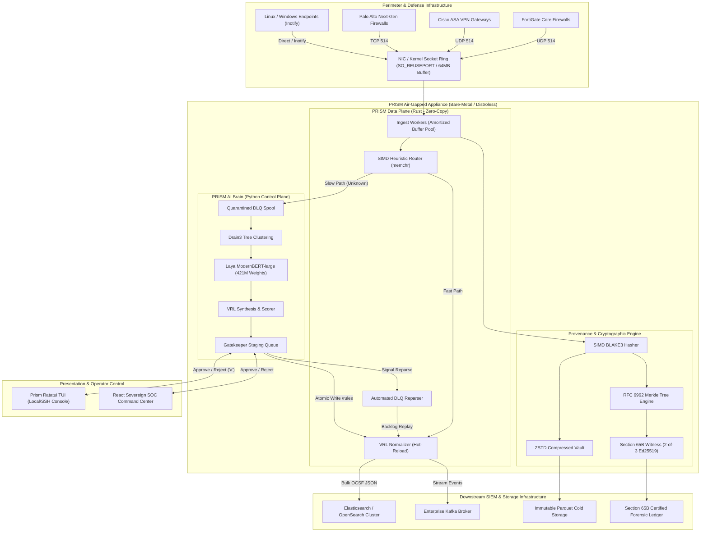
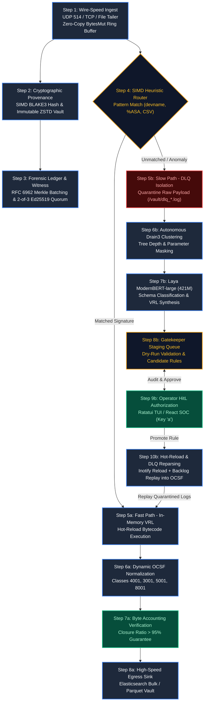

# PRISM Detailed Engineering & Production Deployment Guide

## 1. Production Deployment Topology

<p align="center">
  
</p>

<details>
<summary><b>🔍 View Deployment Topology Mermaid Source</b></summary>


</details>

### Single-Node Bare-Metal Topology (ADR-01)
```
[Perimeter Firewalls / Gateways (Fortinet, Cisco ASA, Palo Alto, Linux Syslog)]
       │  UDP/TCP port 514 (Kernel SO_REUSEPORT)
       ▼
┌────────────────────────────────────────────────────────────────────────┐
│  PRISM High-Performance Host (8+ Cores, 16GB+ RAM, NVMe Storage)       │
│                                                                        │
│  ┌─────────────────────────────┐      ┌──────────────────────────────┐ │
│  │     prism (Rust Binary)     │      │   prism-brain (Python SLM)   │ │
│  │   • Ingestion Workers (514) │      │   • Drain3 Tree Clustering   │ │
│  │   • SIMD Heuristic Router   │◄────►│   • Laya ModernBERT (421M)   │ │
│  │   • VRL Normalizer (Hot)    │      │   • VRL Synthesizer & Scorer │ │
│  │   • BLAKE3 Merkle Vault     │      │   • Gatekeeper HitL Queue    │ │
│  │   • Automated DLQ Reparser  │      │   • Inotify Watcher Loop     │ │
│  └──────────────┬──────────────┘      └──────────────┬───────────────┘ │
│                 │                                    │                 │
│                 └──────────────────┬─────────────────┘                 │
│                                    ▼                                   │
│                         /data/prism (NVMe / SSD)                       │
│                         ├── /vault (ZSTD Compressed Chunks)            │
│                         ├── /rules (*.vrl Dynamic Rules)               │
│                         ├── /rule_metadata (*.json States)             │
│                         └── /vault/ledger.log (Merkle 65B Checkpoints) │
└────────────────────────────────────┬───────────────────────────────────┘
                                     │ HTTP Bulk Sink (OCSF JSON)
                                     ▼
                [Elasticsearch / OpenSearch / Kafka / Parquet]
```

---

## 2. End-to-End Data Pipeline Architecture

<p align="center">
  
</p>

<details>
<summary><b>🔍 View Data Flow Diagram Mermaid Source</b></summary>


</details>

---

## 3. Linux Kernel Optimization & Socket Tuning

To guarantee lossless ingestion at >100,000 EPS without buffer overflow, apply the following kernel socket parameters:

```bash
# /etc/sysctl.d/99-prism.conf
# Increase max receive socket buffer sizes to 64MB
net.core.rmem_max = 67108864
net.core.rmem_default = 33554432

# Increase network device backlog queue
net.core.netdev_max_backlog = 500000

# Increase maximum file descriptors
fs.file-max = 2097152

# Disable slow start on idling connections
net.ipv4.tcp_slow_start_after_idle = 0
```
Apply with:
```bash
sudo sysctl --system
```

---

## 4. Air-Gapped High-Security Operations

PRISM is purpose-built to operate in strictly air-gapped environments without any external internet connectivity.

### Prerequisites Checklist:
1. **Model Cache**: Pre-download Laya weights to `/opt/models/convaiinnovations/laya`.
2. **Container Image**: Export distroless image via `docker save prism:latest | gzip > prism-airgap.tar.gz`.
3. **Execution**:
   ```bash
   docker run --network none \
     -v /data/vault:/tmp/prism/vault \
     -v /data/rules:/tmp/prism/rules \
     -p 514:514/udp \
     prism:latest
   ```

---

## 5. Kubernetes Production Deployment Manifest

```yaml
apiVersion: apps/v1
kind: Deployment
metadata:
  name: prism-collector
  namespace: sovereign-soc
spec:
  replicas: 3
  selector:
    matchLabels:
      app: prism
  template:
    metadata:
      labels:
        app: prism
    spec:
      containers:
      - name: prism-data-plane
        image: prism:latest
        imagePullPolicy: IfNotPresent
        resources:
          limits:
            cpu: "4"
            memory: 8Gi
          requests:
            cpu: "2"
            memory: 4Gi
        ports:
        - containerPort: 514
          protocol: UDP
          name: syslog-udp
        volumeMounts:
        - name: vault-storage
          mountPath: /data/prism/vault
        - name: rules-storage
          mountPath: /data/prism/rules
      volumes:
      - name: vault-storage
        persistentVolumeClaim:
          claimName: prism-vault-pvc
      - name: rules-storage
        configMap:
          name: prism-rules-config
```
