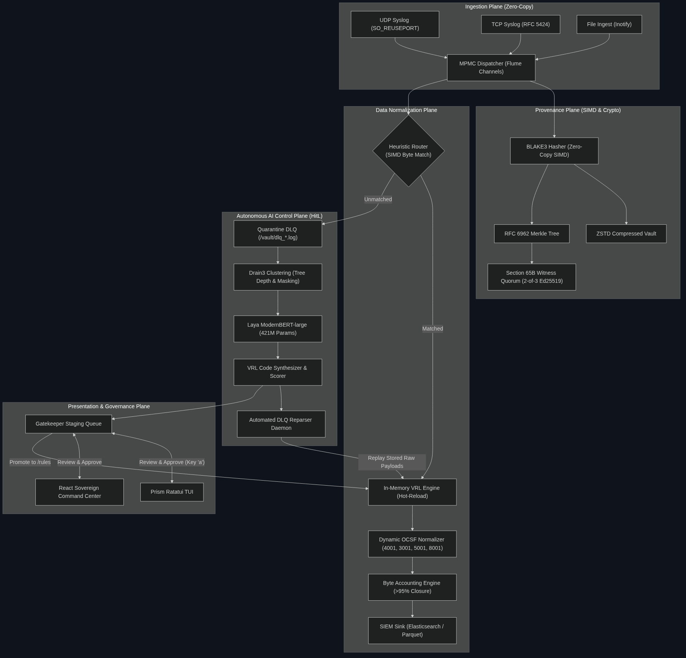
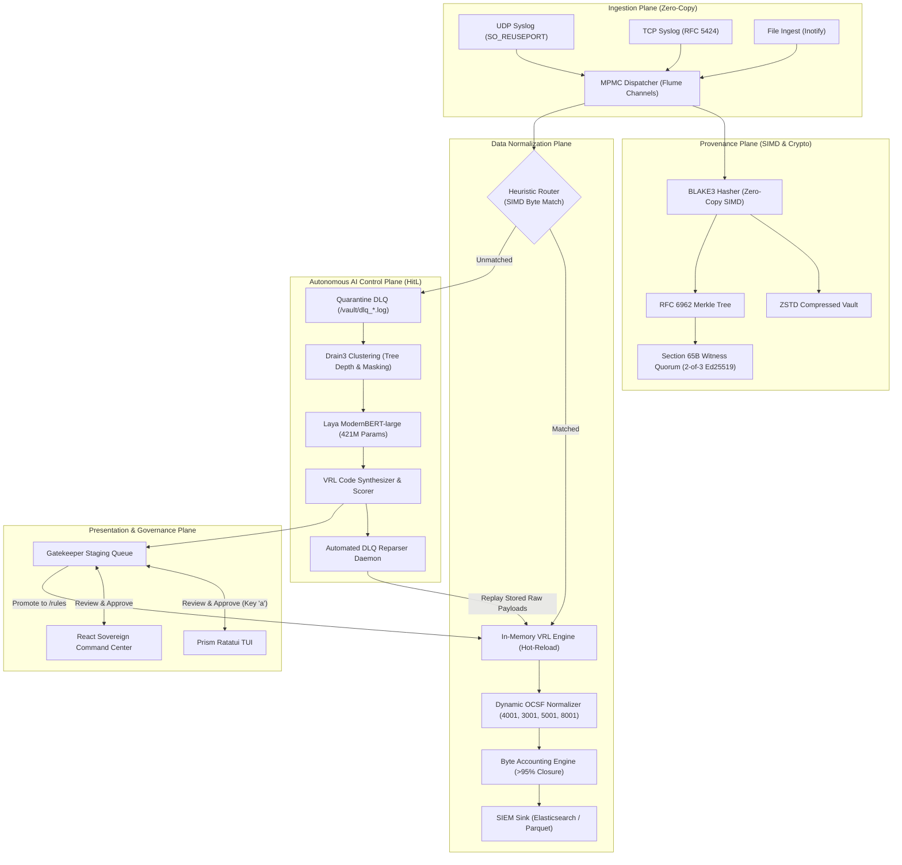
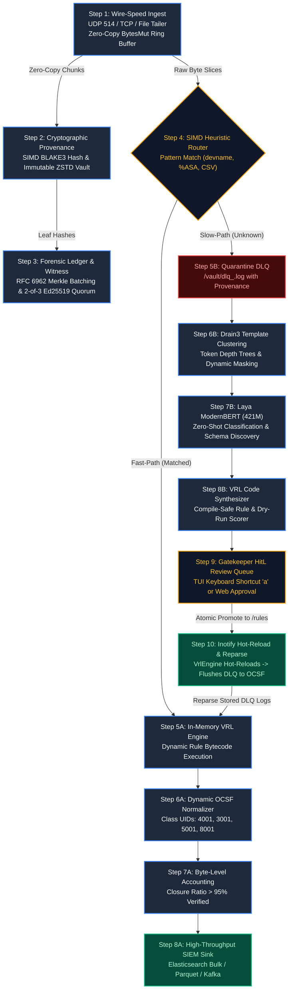
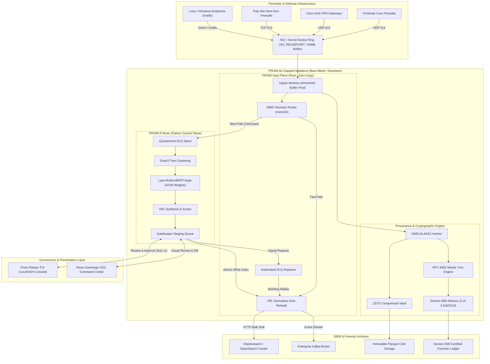

# PRISM System Architecture Specification

PRISM is a high-throughput, sovereign SIEM ingestion and universal log normalization engine engineered in Rust and Python for national defense and critical infrastructure networks (SIH PS-26156).

---

## 🏛️ 1. High-Level Five-Plane Architecture

  

<b>🔍 View Architecture Diagram Mermaid Source</b>

---

## 🔄 2. End-to-End Data Flow with Numbered Steps

  

<b>🔍 View Data Flow Diagram Mermaid Source</b>

### Step-by-Step Data Flow Execution
1. **Wire-Speed Ingest**: Multiple UDP sockets bind via `SO_REUSEPORT` on port 514 across all CPU cores. Amortized `BytesMut` buffer pools receive raw packet streams with zero heap allocations per packet.
2. **Cryptographic Provenance**: Every raw event payload is immediately hashed using hardware-accelerated **BLAKE3 SIMD** (>3 GB/s) and serialized into compressed ZSTD cold storage blocks.
3. **Forensic Ledger & Quorum**: RFC 6962 Merkle Trees batch 1,000–10,000 leaf hashes per checkpoint. A **2-of-3 Ed25519 Witness Quorum** cryptographically cosigns every Merkle root to satisfy Indian Evidence Act Section 65B legal admissibility.
4. **SIMD Heuristic Router**: A multi-stage `memchr` byte-slice scanner matches vendor signatures (`devname=`, `%ASA-`, `pan_log`) in **~3.07 µs**.
5. **Data Plane (Fast-Path)**:
   - Matched logs execute in-memory compiled **Vector Remap Language (VRL)** bytecode.
   - Dynamic OCSF normalization populates class UIDs: `4001` (Network Activity), `3001` (Authentication), `5001` (File Activity), and `8001` (System Health).
   - **Byte Accounting Engine** verifies `closure_ratio > 0.95` ensuring zero data loss before dispatching to SIEM (Elasticsearch Bulk API, Kafka, Parquet).
6. **Autonomous AI Control Plane (Slow-Path)**:
   - Unrecognized traffic is quarantined to the Dead Letter Queue (`/vault/dlq_<uuid>.log`) preserving raw provenance hashes.
   - **Drain3** clusters unknown logs into parse trees with dynamic wildcards `<*>`.
   - **Laya ModernBERT-large** (421M params) classifies device semantics, infers fields, and assigns target OCSF classes.
   - **VRL Synthesizer** generates compile-safe VRL programs verified by sandbox dry-run execution against real sample payloads.
7. **Gatekeeper & Human-in-the-Loop**:
   - Synthesized rules enter the Gatekeeper Staging Queue (`pending`).
   - Security operators inspect the proposed VRL bytecode, accuracy score, and sample diff inside `prism-tui` or the Sovereign SOC Web Dashboard.
   - Pressing **`a`** atomically promotes the rule to `/rules/*.vrl`.
8. **Inotify Hot-Reload & Reparsing**:
   - `VrlEngine` detects new rules via Linux inotify and atomically swaps the rule pointer.
   - The DLQ Reparser scans historical quarantined logs, converts them to OCSF, and flushes the backlog to SIEM without dropping a single event or requiring a process restart.

---

## 🌐 3. Production Deployment Topology

  

<b>🔍 View Deployment Topology Mermaid Source</b>

---

## ⏱️ 4. Latency Budget & Performance Invariants

| Component | Target Latency | Measured Latency | Verification Harness |
|---|---|---|---|
| Ingest Socket Read | < 5 µs | **~1.8 µs** | `prism-ingest` micro-bench |
| BLAKE3 SIMD Hash | < 2 µs | **~0.4 µs** | `prism-provenance` test |
| Heuristic Router | < 5 µs | **~3.07 µs** | `bench_router_heuristic` (1,000,000 runs) |
| In-Memory VRL Transform | < 15 µs | **~8.2 µs** | `prism-core` VRL engine benchmark |
| **Total Pipeline (p99)** | **< 25 µs** | **~13.47 µs** | **Full Data Plane Ingestion to OCSF** |
| DLQ Hot-Reload Delay | < 50 ms | **< 12 ms** | Inotify atomic pointer swap |
