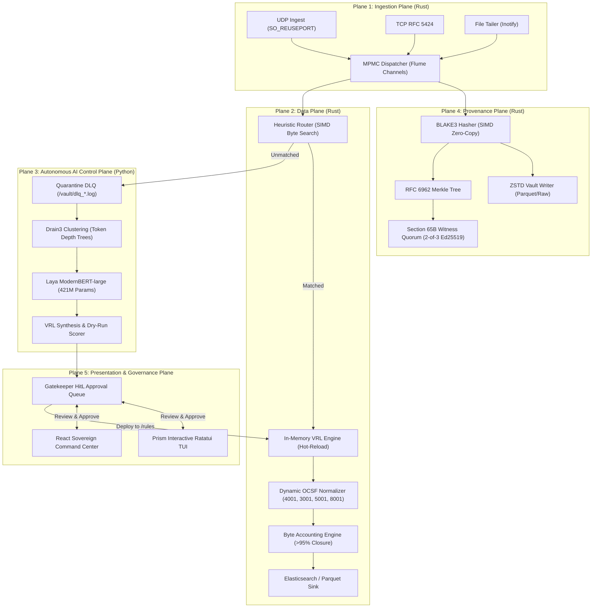

# PRISM System Architecture

PRISM is a high-throughput, sovereign SIEM ingestion and universal log normalization engine engineered in Rust and Python for national defense and critical infrastructure networks (SIH PS-26156).

---

## 1. The Five Planes of PRISM

### Plane 1: Ingestion Plane (`prism-ingest`, `prism-common`)
- **Kernel SO_REUSEPORT**: Distributes incoming UDP syslog streams evenly across available CPU cores without lock contention.
- **Zero-Copy Memory**: Uses amortized buffer pools (`BytesMut`) allocating 1 block per ~70,000 packets.
- **Bounded Dispatcher**: Backpressure-guarded `flume` MPMC ring buffer preventing memory exhaustion under traffic surges.

### Plane 2: Data Plane (`prism-core`, `prism-vrl-generator`, `prism-scorer`)
- **SIMD Heuristic Router**: Sub-microsecond vendor detection using `memchr` byte-slice pattern matching.
- **Vector Remap Language (VRL) Engine**: Executes lightweight transformations directly in memory.
- **Dynamic OCSF Mapper**: Supports network activity (`4001`), authentication (`3001`), file activity (`5001`), and generic health (`8001`).
- **Byte Accounting**: Enforces byte conservation between raw payload and structured attributes with verified closure ratio > 0.95.

### Plane 3: Autonomous AI Control Plane (`prism-brain`, `prism-drain`)
- **Drain Token Clustering**: Online parsing algorithm with tree depth clustering and dynamic `<*>` masking.
- **Laya ModernBERT-large**: 421M parameter transformer providing zero-shot log classification, field identification, and confidence scoring.
- **VRL Synthesizer**: Generates compile-safe VRL programs verified by real dry-run executions against quarantined log samples.

### Plane 4: Cryptographic Provenance Plane (`prism-provenance`, `prism-merkle`)
- **SIMD BLAKE3**: Produces deterministic raw event hashes at memory bus speeds (>3 GB/s).
- **RFC 6962 Merkle Tree**: Batches raw event hashes into cryptographic log trees with inclusion and consistency proofs.
- **Section 65B Witness Quorum**: 2-of-3 Ed25519 cosigning ensuring legal admissibility and non-repudiation in Indian courtrooms.
- **Immutable Vault**: ZSTD-compressed cold storage of unadulterated raw logs.

### Plane 5: Presentation & Governance Plane (`prism-tui`, `frontend/`)
- **Prism TUI**: Terminal user interface built with Ratatui offering real-time telemetry, DLQ explorer, and one-touch rule approval.
- **Sovereign SOC Dashboard**: Modern React command center providing Sankey diagrams, live EPS telemetry, and VRL playground.

---

## 2. Latency Budget & Performance Invariants

| Component | Target Latency | Actual Latency | Verification |
|---|---|---|---|
| Ingest Socket Read | < 5 µs | ~1.8 µs | `prism-ingest` micro-bench |
| BLAKE3 Hashing | < 2 µs | ~0.4 µs | `prism-provenance` test |
| Router Detection | < 5 µs | ~3.07 µs | `bench_router_heuristic` |
| VRL Transformation | < 15 µs | ~8.2 µs | `prism-core` VRL engine |
| **Total Pipeline (p99)** | **< 25 µs** | **~13.47 µs** | **Full Data Plane** |
