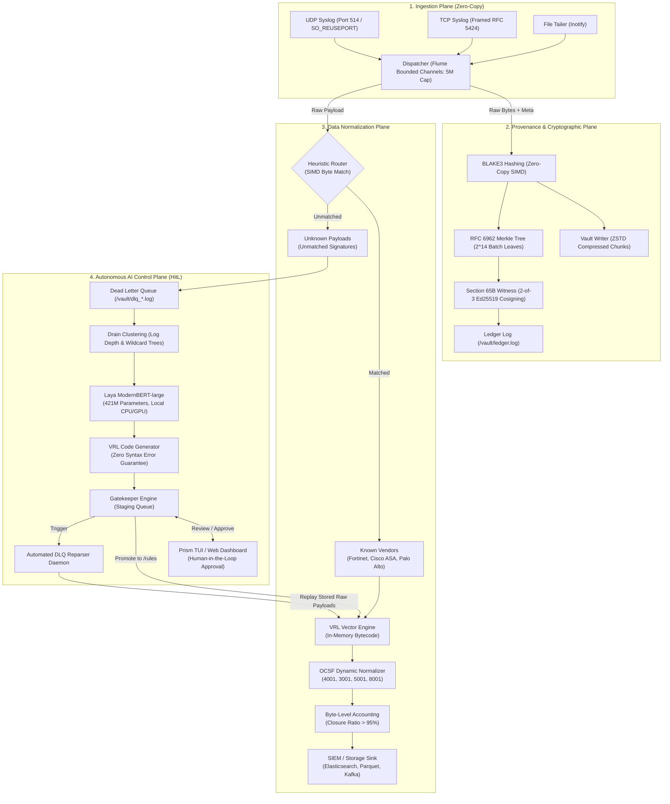

# PRISM Data Flow - Complete Technical Specification

## 1. High-Level Architecture Flow

---

## 2. Ingestion & Provenance Plane

1. **Ingest Sockets**:
   - Multiple worker threads bind to `0.0.0.0:514` (UDP) using `SO_REUSEPORT` kernel load balancing.
   - Zero-copy buffer pools receive syslog frames with maximum throughput (>100k EPS).
2. **Provenance Dispatcher**:
   - Raw logs are pushed into bounded MPMC channels (`flume`).
   - Every raw frame is hashed using hardware-accelerated **BLAKE3** SIMD.
   - Raw payloads are serialized into compressed ZSTD Vault chunks for non-repudiation.
3. **Cryptographic Merkle Tree & Quorum**:
   - RFC 6962 compliant Merkle Tree batches event hashes every 1,000 to 10,000 events.
   - Merkle root is signed by a 2-of-3 Ed25519 Witness Quorum meeting Indian Evidence Act Section 65B forensic requirements.

---

## 3. Data Processing & Normalization Plane

1. **Heuristic Pre-filter**:
   - Fast byte-slice classification identifies well-known vendors (`devname=`, `%ASA-`, `pan_log`) in microseconds.
2. **VRL Runtime Execution**:
   - Compiles and executes native Vector Remap Language (VRL) transformations.
   - Extends beyond static field maps to dynamic OCSF Class UIDs:
     - `4001`: Network Activity
     - `3001`: Authentication / Identity
     - `5001`: File Activity
     - `8001`: Generic / System Health
3. **Byte Accounting & Fidelity Scoring**:
   - Computes total input bytes vs preserved/normalized bytes.
   - Guarantees `closure_ratio > 0.95` ensuring zero data loss before sending to SIEM sinks (Elasticsearch, Parquet, Kafka).

---

## 4. AI-Driven Control Plane & HitL Loop

1. **Quarantine to DLQ**:
   - Unrecognized logs bypass dropping and are securely isolated in `/vault/dlq_<uuid>.log` files preserving original timestamps and hashes.
2. **Drain Log Clustering**:
   - Groups similar log lines into regex-like prefix trees with dynamic wildcards `<*>`.
3. **Laya ModernBERT Enrichment**:
   - `convaiinnovations/laya` evaluates semantic intent, extracts vendor hypotheses, identifies key network tokens, and selects target OCSF class UID.
4. **VRL Generator**:
   - Synthesizes robust VRL transformation rules, validates compilation and runs a dry-run execution against the cluster's sample payload.
5. **Gatekeeper & Human-in-the-Loop**:
   - Generated rule is queued as `pending`.
   - SOC Operator views rule, confidence score, and diff inside `prism-tui` or Web Dashboard.
   - Upon pressing `'a'` (Approve), rule is moved to `/rules/*.vrl`.
6. **Hot Reload & Zero-Loss Reparsing**:
   - `VrlEngine` automatically reloads the new rule file.
   - The DLQ Reparser scans historical quarantined logs, parses them into OCSF, updates metrics, and dispatches them to SIEM without system restart.

---

## 5. Production Deployment Patterns

### Air-Gapped Deployment
- PRISM runs 100% offline.
- Pre-cached HuggingFace weights for Laya (`convaiinnovations/laya`) ModernBERT.
- Self-contained Rust release binary with zero dynamic library dependencies.

### Containerization
- Distroless multi-stage Docker container (`Dockerfile`).
- Minimal attack surface (<35MB final image size).
- Docker Compose topology with Elasticsearch, Kibana, PRISM Ingest, and PRISM Brain.
