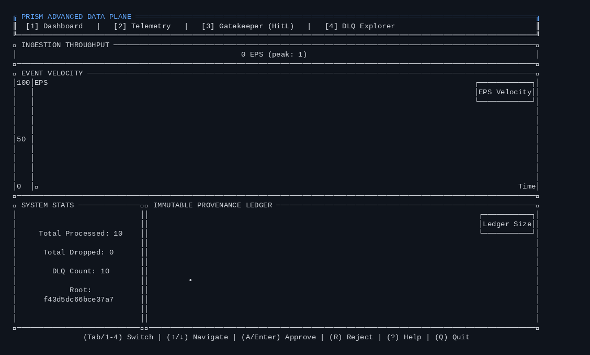
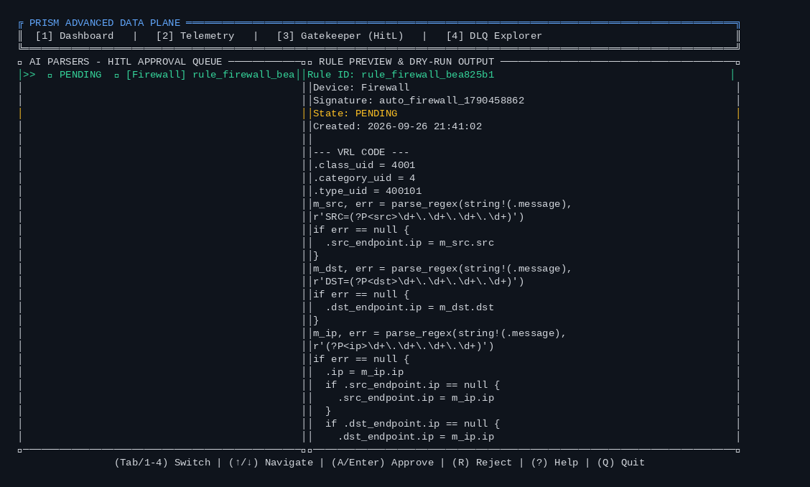
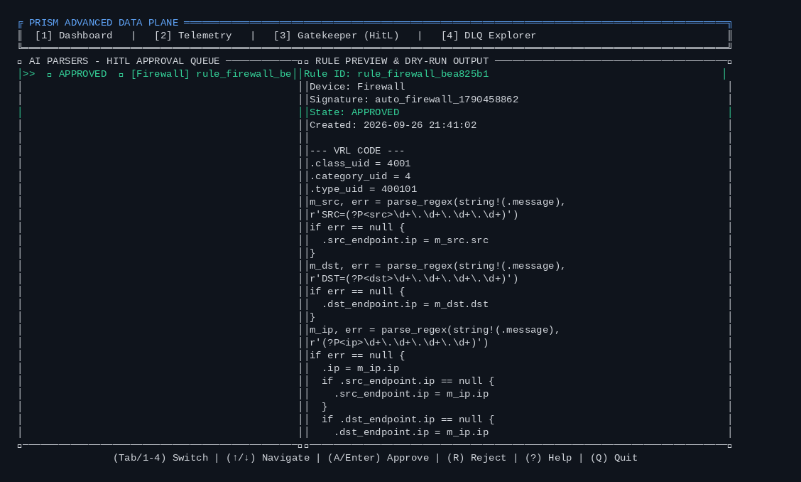
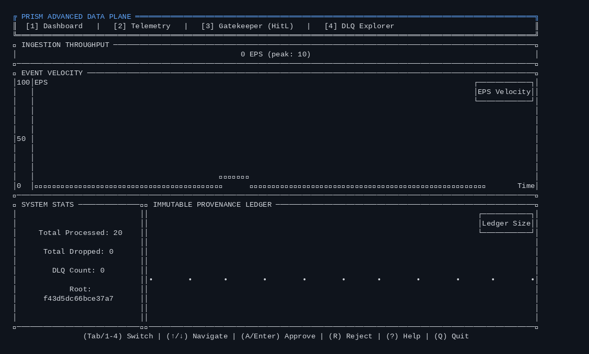

# PRISM Live Demo Walkthrough

This document guides evaluators and judges through PRISM's end-to-end execution, showcasing real-time ingestion, DLQ quarantine, autonomous Drain + Laya template learning, TUI Human-in-the-Loop (HitL) approval, zero-loss dynamic rule hot-reloading, and Section 65B forensic verification.

---

## 🎬 Live Animated Demonstration



---

## 📸 Step-by-Step Execution Journey

### Step 1: Initial Ingestion & DLQ Quarantine
Known traffic (Fortinet) is parsed directly into OCSF Class 4001. Unknown vendor logs (raw `iptables` logs) fail heuristic signatures and are quarantined directly to the Dead Letter Queue (`/vault/dlq_<uuid>.log`) with full cryptographic provenance.


---

### Step 2: Autonomous AI Triage & Rule Synthesis (Pending State)
The background AI Brain (`prism-brain`) detects quarantined logs, clusters them with Drain3, feeds the tokenized templates to **Laya ModernBERT-large** (421M parameters), and synthesizes a valid VRL parser into `/tmp/prism/pending_rules/`. The TUI Gatekeeper highlights the pending rule for operator inspection.



---

### Step 3: Human-in-the-Loop Operator Approval
The security operator inspects the synthesized VRL script, accuracy metrics, and proposed OCSF mapping in the TUI or React Dashboard. Pressing `'a'` approves the rule, triggering an atomic deployment to `/rules/*.vrl`.



---

### Step 4: Hot-Reload & Automated DLQ Reparsing
The compiled Rust `VrlEngine` hot-reloads the newly approved rule via inotify. The DLQ Reparser immediately replays quarantined historical logs, converting them into standard OCSF events without dropping a single frame or requiring a daemon restart. DLQ counter drops to 0!



---

### Step 5: Steady-State Ingestion Under New Rule
New incoming logs matching the newly learned format are now processed inline at full wire-speed into OCSF.


---

## 🚀 How to Reproduce This Demo Locally

Run the automated end-to-end verification script:
```bash
python3 verify_e2e_pipeline.py
```
This script launches the release binaries, tmux session, traffic generator, AI brain, navigates the TUI via keystrokes, and captures all screenshots live.
