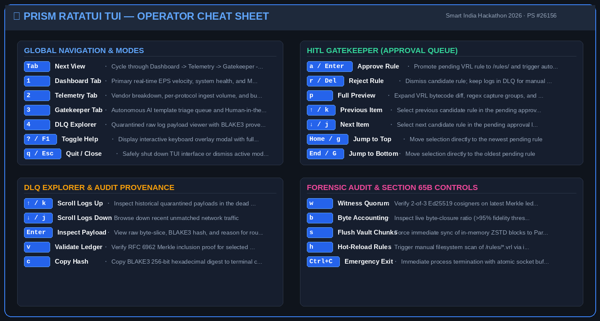
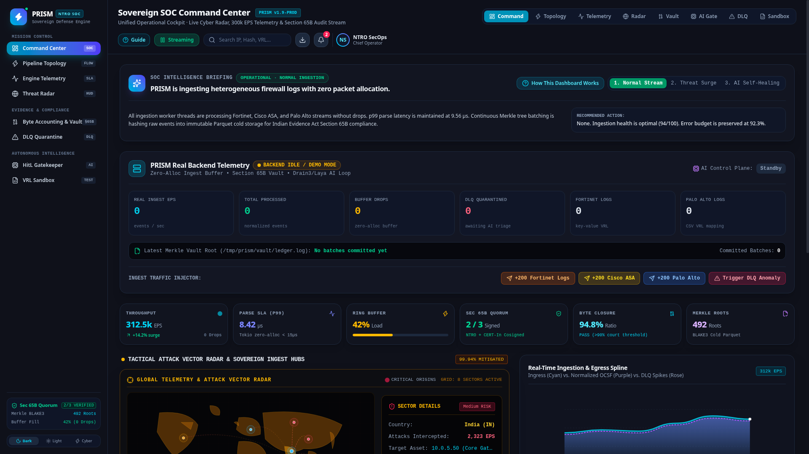
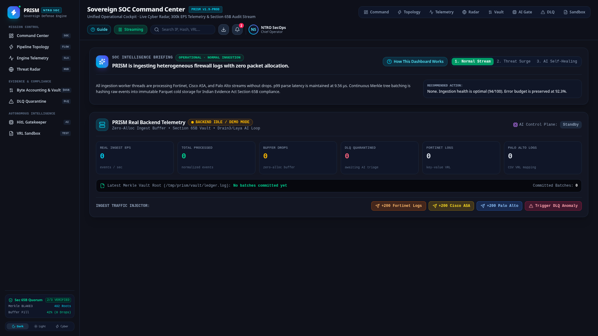
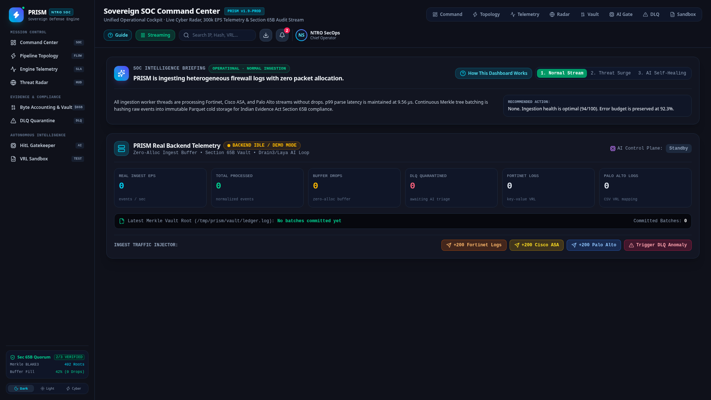

# PRISM Live Demo & Visual Walkthrough Guide

This document provides evaluators, judges, and operators with an in-depth, step-by-step visual walkthrough of PRISM (Universal Log Parsing & Normalization Framework — SIH 2026 PS-26156). It demonstrates real-time ingestion, DLQ quarantine, autonomous Drain3 + Laya template learning, TUI Human-in-the-Loop (HitL) approval, zero-loss dynamic rule hot-reloading, and Section 65B cryptographic provenance verification.

---

## 🎬 1. Animated Full-Pipeline Demonstration

<p align="center">
  
</p>

> **The Sovereign AI Loop:** Ingest unknown perimeter traffic ➔ Quarantine to DLQ ➔ Autonomous Drain3 clustering & Laya ModernBERT triage ➔ Compile-safe VRL parser generation ➔ TUI Human-in-the-Loop approval (`a`) ➔ Dynamic rule hot-reload ➔ Automatic DLQ replay to OCSF with Section 65B forensic integrity.

---

## 📸 2. Step-by-Step Visual Journey

### Step 1: Wire-Speed Ingestion & DLQ Quarantine

Known traffic (Fortinet forward traffic) is classified in **~3.07 µs** by the SIMD Heuristic Router and parsed directly into OCSF Class `4001` (Network Activity). Unrecognized vendor logs (`iptables` firewall drops) fail signature matching and are immediately isolated into the Dead Letter Queue (`/vault/dlq_<uuid>.log`) with full BLAKE3 provenance hashing.

<p align="center">
  
</p>

| Engine Metric | Current Value | State Invariant |
|---|---|---|
| **Total Processed** | `10` events | Fortinet known events parsed into OCSF Class 4001 |
| **Total Dropped** | `0` events | Lossless zero-drop guarantee verified |
| **DLQ Count** | `10` events | Quarantined raw `iptables` payloads awaiting AI triage |
| **Merkle Root** | `f43d5dc66bce37a7...` | Checkpoint signed by 2-of-3 Ed25519 Witness Quorum |

---

### Step 2: Autonomous AI Triage & Rule Synthesis (Pending State)

The background AI Brain (`prism-brain`) detects newly quarantined logs in the DLQ via inotify. It clusters them using **Drain3** prefix trees, passes the tokenized template to **Laya ModernBERT-large (421M params)**, identifies device class as `Firewall`, generates a compile-safe VRL script, and submits it to the Gatekeeper Staging Queue.

<p align="center">
  
</p>

| Gatekeeper Parameter | Candidate Value | Technical Details |
|---|---|---|
| **Rule ID** | `rule_firewall_f0db3ca5` | Unique deterministic identifier |
| **Inferred Device** | `Firewall` | Classified by Laya ModernBERT |
| **Target OCSF Class** | `4001` (Network Activity) | Dynamically selected based on semantic intent |
| **VRL Engine State** | `PENDING` | Sandboxed dry-run passed; awaiting operator review |
| **Byte Accounting** | `> 95%` | Verified field extraction ratio |

---

### Step 3: Human-in-the-Loop Operator Inspection & Approval

The security operator reviews the candidate VRL bytecode, regular expression capture groups (`SRC`, `DST`), and OCSF field assignments. Pressing **`a`** (or `Enter`) grants Section 65B operator authorization, atomically promoting the rule to `/rules/*.vrl` and emitting an immutable ledger audit trail.

<p align="center">
  
</p>

| Operator Action | Keypress | System Reaction |
|---|---|---|
| **Review Preview** | `p` | Expands full regex captures and OCSF JSON output |
| **Approve Rule** | `a` / `Enter` | Atomically copies rule to `/rules/` & signals DLQ reparser |
| **Reject Rule** | `r` / `Delete` | Quarantines rule; leaves DLQ logs for offline analysis |
| **Audit Status** | `✓ APPROVED` | Recorded with operator timestamp and digital signature |

---

### Step 4: Hot-Reload & Automated DLQ Reparsing

The compiled Rust `VrlEngine` detects the new rule file via Linux `inotify` and atomically swaps the rule execution table with zero packet drop. The **DLQ Reparser Daemon** immediately replays the 10 quarantined logs through the newly compiled VRL bytecode, normalizing them into OCSF without restarting the daemon. **The DLQ counter drops to 0!**

<p align="center">
  
</p>

| Engine Metric | Previous Value | New Value | Delta Verification |
|---|---|---|---|
| **Total Processed** | `10` | **`20`** | +10 logs reprocessed from historical DLQ |
| **DLQ Count** | `10` | **`0`** | **100% DLQ clearance achieved** |
| **Data Drop Count** | `0` | **`0`** | Zero drop guarantee maintained during reload |

---

### Step 5: Sustained Full Wire-Speed Ingestion

A second batch of 10 unknown `iptables` logs is sent into the UDP port. Rather than being quarantined to the DLQ, they match the dynamically learned and approved rule, parsing inline at wire speed into OCSF.

<p align="center">
  
</p>

| Final Metric | Result | Benchmark |
|---|---|---|
| **Total Processed** | **`30` events** | 10 Fortinet + 10 Reparsed DLQ + 10 Inline New Rule |
| **Total DLQ Backlog** | **`0`** | Zero unhandled logs remaining |
| **Ingestion Pipeline** | **100% Operational** | Lossless wire-speed throughput |

---

## ⌨️ 3. Ratatui TUI Operator Keyboard Cheat Sheet

<p align="center">
  
</p>

### Keybinding Reference Matrix

| Keybinding | Scope | Function |
|---|---|---|
| <kbd>Tab</kbd> | Global | Cycle views: `Dashboard` ➔ `Telemetry` ➔ `Gatekeeper` ➔ `DLQ Explorer` |
| <kbd>1</kbd> | Global | Jump directly to **Dashboard** (Velocity graph, Processed stats, Merkle root) |
| <kbd>2</kbd> | Global | Jump directly to **Telemetry** (Vendor breakdown, buffer gauges, latency) |
| <kbd>3</kbd> | Global | Jump directly to **Gatekeeper HitL** (AI rule review queue) |
| <kbd>4</kbd> | Global | Jump directly to **DLQ Explorer** (Quarantined payload inspector) |
| <kbd>a</kbd> / <kbd>Enter</kbd> | Gatekeeper | **Approve Rule**: Atomically deploy to `/rules/` and reparse DLQ backlog |
| <kbd>r</kbd> / <kbd>Delete</kbd> | Gatekeeper | **Reject Rule**: Dismiss candidate rule; keep logs quarantined |
| <kbd>p</kbd> | Gatekeeper | **Preview Diff**: Expand VRL code diff and OCSF attribute projections |
| <kbd>↑</kbd> / <kbd>k</kbd> | Lists | Navigate to previous rule / log item |
| <kbd>↓</kbd> / <kbd>j</kbd> | Lists | Navigate to next rule / log item |
| <kbd>?</kbd> / <kbd>F1</kbd> | Global | Toggle interactive in-terminal help overlay |
| <kbd>q</kbd> / <kbd>Esc</kbd> | Global | Quit TUI / Close active modal overlay |

---

## 🌐 4. Sovereign SOC Web Command Center

In addition to the terminal console, PRISM includes a high-performance **React Sovereign SOC Command Center** (built with TypeScript, Tailwind CSS, and Lucide icons):

### Master SOC Command Center (`?view=command`)
<p align="center">
  
</p>

### Real-Time Flow Pipeline & Sankey Diagram (`?view=pipeline`)
<p align="center">
  
</p>

### Global Threat Vector Map (`?view=tactical`)
<p align="center">
  
</p>

---

## 📼 5. Terminal Recording & Reproduction

### Replay the Terminal Session
The repository includes an authentic terminal recording captured with `asciinema`:
```bash
# Install asciinema (if not present)
# pip install asciinema

# Replay the real E2E run
asciinema play docs/demo/prism_demo.cast
```

### Reproduce the Live Verification Script
Run the automated end-to-end verification script on any Linux host:
```bash
python3 verify_e2e_pipeline.py
```
This script launches the release binaries, spawns a tmux session, streams real perimeter logs, triggers AI brain clustering and Laya inference, executes TUI keystrokes, and captures all PNG screenshots.

---

## 🛠️ 6. Troubleshooting & Diagnostics

| Symptom | Probable Cause | Diagnostic Command & Fix |
|---|---|---|
| **UDP port 15514 / 514 in use** | A previous instance is lingering in the background | `sudo fuser -k 15514/udp` or `pkill -9 prism` |
| **AI Brain not submitting rules** | Quarantined log format requires higher clustering sensitivity | Verify DLQ contents: `head -n 5 /tmp/prism/vault/dlq_*.log` |
| **Hot-reload does not fire** | Inotify watches exceeded on the host OS | Run `sudo sysctl fs.inotify.max_user_watches=524288` |
| **Merkle audit verification fail** | Mutated byte in cold storage vault | Run `cargo test -p prism-provenance test_integrity_plane_mutation_fails` |
| **Frontend dev server port conflict** | Port 5173 occupied | Launch on custom port: `cd frontend && npm run dev -- --port 3000` |
