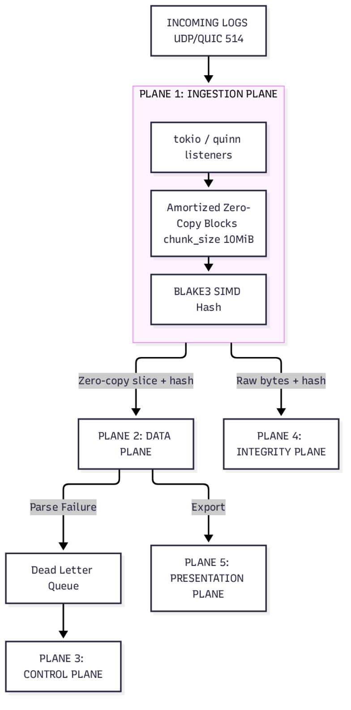
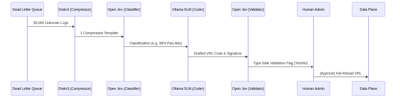
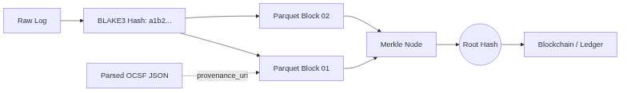

# Project PRISM: Official Technical Whitepaper
**Name:** Programmable Routing & Intelligent Semantic Mapper (PRISM)
**Target:** Universal Log Pre-processing Framework (SIH26156 - NTRO)
**Team:** SPECTRE
**Classification:** Technical Defense & Architecture Document

---

## 1. The NTRO Context & Legacy Infrastructure Failure
Indian government intelligence and cybersecurity bodies (NTRO, NCIIPC, CERT-In) currently rely heavily on legacy SIEM architectures (ELK Stack, Splunk). Our research identifies four quantifiable failure points in these systems:

1. **Logstash Grok CPU Saturation:** Manual regex parsing causes immediate CPU saturation.
2. **Elasticsearch Mapping Explosions:** Schema drift leads to cluster "split-brain" failures.
3. **The 180-Day CERT-In Mandate:** Storing 6 months of hot data natively in a SIEM is financially unsustainable.
4. **The 6-Hour Reporting Window:** Broken parsers create alert fatigue, causing analysts to miss critical reporting windows.

---

## 2. The Novel Solution: 4-Plane Architecture

The industry fails because it faces the **Latency-Cost Trilemma**: Regex is fast but brittle; inline AI parsing is adaptable but mathematically too slow for 1.18 GB/s. We explicitly decouple *throughput* from *intelligence*.

### Plane 1: The Ingestion Plane (The Catcher)
* **Function:** Bind to UDP, TCP, and Next-Gen QUIC ports. Captures data into a Zero-Copy memory pool (Amortized BytesMut Blocks) to prevent memory allocator bottlenecking.
* **Integrity Hook:** Every raw byte slice is hashed via BLAKE3 (SIMD parallelized, FIPS-configurable) instantly.

### Plane 2: The Data Plane (The Muscle)
* **Function:** Gbps exact-match deterministic parsing and routing to OCSF (Open Cybersecurity Schema Framework) sinks.
* **Tech Stack:** Rust / Tokio executing **Vector Remap Language (VRL)**. 
* **Dynamic Routing:** Heuristic packet sniffer that bypasses heavy regex. Unrecognized packets are routed to the DLQ (Dead Letter Queue).

### Plane 3: The Control Plane (The Brain)
* **Function:** Autonomous onboarding of unknown logs using a **Dual-AI (System 1 + System 2)** architecture.

* **Drain3 Compressor:** Reduces 50,000 unknown logs into 1 static template to prevent token-exhaustion.
* **Open Jev (System 1):** A non-generative, hallucinaton-free AI classifies the template (e.g., "98% Palo Alto Threat Log").
* **Ollama (System 2):** A generative SLM (Llama-3) writes the VRL parser code using the template and Jev's classification.
* **HitL Gatekeeper:** The drafted code is verified by Open Jev for type-safety and presented to a human admin for 1-click Hot-Reload approval.

### Plane 4: The Integrity Plane (The Bone)
* **Function:** Cryptographic forensic traceability to prove chain-of-custody for intelligence audits.

* **Tech Stack:** Raw logs are written to highly compressed **Apache Parquet** cold storage. Hashes are periodically committed to a **Merkle Tree**. 
* **The Pointer:** Normalized OCSF output contains a pointer (`_batch_uri`) to the immutable raw vault, satisfying CERT-In's 180-day retention mandate at a fraction of the cost.

---

## 3. Academic Validation & Next-Gen Implementations (2024-2026)

* **Citation 1:** *DivLog: Log Parsing with Prompt Enhanced In-Context Learning* (ICSE 2024) - Validates our SLM parser generation.
* **Citation 2:** *System 1 vs System 2 AI* (Open Jev / TypeSafe AI 2026) - Validates the deterministic mathematical cage surrounding our generative AI.
* **Citation 3:** *LogCrisp & KELP* (ATC 2025 / arXiv 2026) - Validates our SIMD (BLAKE3) and Zero-Copy Rust architecture.
* **Citation 4:** *Hybrid Blockchain Logging Architectures* (2023-2025) - Validates our Merkle Tree / Parquet storage strategy for forensic preservation.
