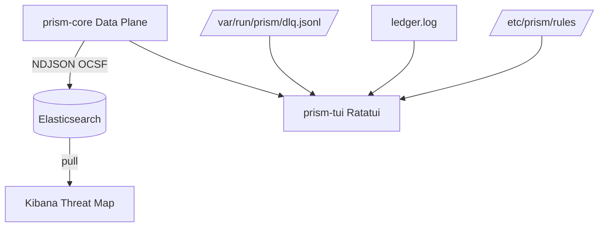

# PRISM SIEM Integration & Demo (Plane 5)

## Live Data Path Overview

PRISM uses a Push-based approach (rather than Kibana pulling).

**Pipeline Path:**
1. `prism-core` parses logs and builds `OcsfNetworkActivity` (Class 4001).
2. The `sink.rs` module converts the OCSF batch into NDJSON (Newline Delimited JSON).
3. The NDJSON is POSTed via `reqwest` to the Elasticsearch Bulk API: `http://localhost:9200/prism-ocsf/_bulk`.
4. Kibana (running on port 5601) connects to Elasticsearch.
5. In Kibana, an index pattern `prism-ocsf*` is created.
6. The Discover view and Dashboards show live threat maps based on `src_endpoint.ip` and `dst_endpoint.ip`.

## TUI (Terminal User Interface)

The presentation plane also includes a 4-pane dashboard written in Rust (Ratatui/Crossterm) to give instant local observability.

*   **Pane 1 (Live EPS):** Polls an `Arc<AtomicU64>` metric updated by the ingestion dispatcher.
*   **Pane 2 (DLQ Rate):** Polls the line count of `/var/run/prism/dlq.jsonl` where unmatched logs go.
*   **Pane 3 (Merkle Ticker):** Tails `output_dir/ledger.log` to display the most recent root hash of the integrity plane.
*   **Pane 4 (Gatekeeper HitL):** Lists pending or approved AI drafts (VRL rules) generated by L3 from `/etc/prism/rules`.

